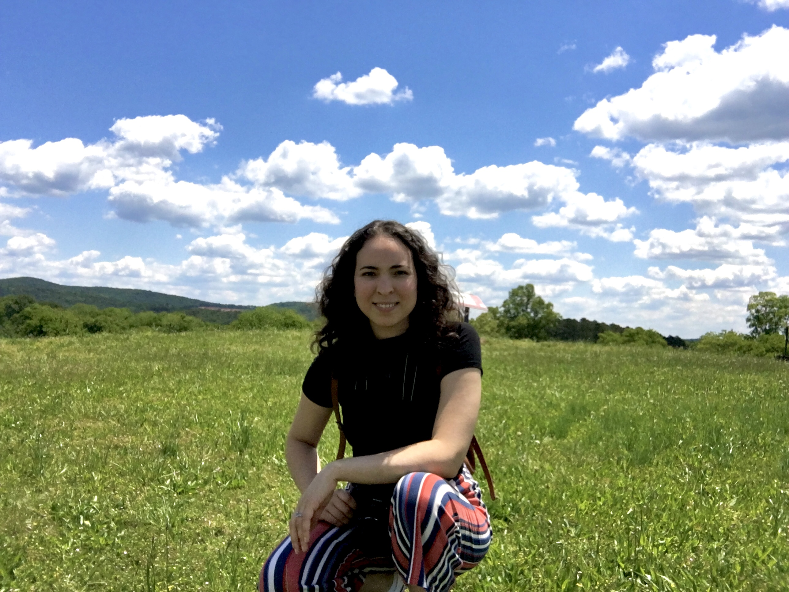

#### About me

I am a Physics PhD who is currently working as an AI/ML Applied Scientist using NLP and Generative AI to solve problems in Healthcare. In recent years, I have been working in the R&D sector, leading the development of frameworks in Python and applying Machine Learning algorithms and Large Language Models to solve complex business problems. Although my current work and interests are more aligned with the responsibilities of a Machine Learning Scientist/Engineer, I also have experience working as a Data Scientist doing data analysis, data cleaning and preprocessing, feature engineering, model training and evaluation, and client communication. 

Prior to working in Industry, I worked as a Physics Postdoctoral Researcher at the University of Pittsburgh. In that role, I conducted research and published papers in Gravitational Waves and Effective Field Theory, led and managed projects while mentoring PhD students, organized conferences, gave talks in the US and abroad.

I am passionate about tackling challenging and complex problems, especially in collaboration with other curious peers. I love to work on projects that allow me to continue learning, improving my depth and breadth in Science, while building solutions that benefit people.

- 🔭 I’m currently working on: Artificial Intelligence and Machine Learning
- 🤝 I’m looking to collaborate on: AI, Machine Learning, Physics, Environment
- 📡 How to reach me: connect with me at <a href="https://www.linkedin.com/in/natalia-tenorio-maia/">LinkedIn</a>
- 🧙 Pronouns: she/her

#### AI / ML/ Data Science Public Projects:
- Nurse AI Assistant: <a href="https://github.com/NataliaTenorioMaia/nurse_ai_assistant"> GitHub Repo </a> / <a href="https://nataliatenoriomaia-nurse-ai-assistant-app-jffmk8.streamlit.app/">Streamlit App</a>
- Youtube Video Recommender: <a href="https://github.com/NataliaTenorioMaia/Portfolio/tree/main/Youtube_Video_Recommender#readme">GitHub Repo</a> / <a href="https://stormy-lake-83008.herokuapp.com">Heroku App</a>
- Amazon Deforestation Data Analysis: <a href="https://github.com/NataliaTenorioMaia/Portfolio/blob/main/Brazilian_Amazon_Deforestation#readme">GitHub Repo</a>
- Complete Python Solutions to Andrew Ng's Machine Learning Course: <a href="https://github.com/NataliaTenorioMaia/MachineLearning_AndrewNg_PythonSolutions#readme">GitHub Repo</a>

#### Physics research publications:
- Next-to-leading order spin-orbit effects in the equations of motion, energy loss and phase evolution of binaries of compact bodies in the effective field theory approach: <a href="https://arxiv.org/abs/2009.05628">arXiv</a> / <a href="https://journals.aps.org/prd/abstract/10.1103/PhysRevD.102.124020">Physical Review D</a>
- Second post-Newtonian order radiative dynamics of inspiralling compact binaries in the Effective Field Theory approach: <a href="https://arxiv.org/abs/1912.12546">arXiv</a> / <a href="https://journals.aps.org/prd/abstract/10.1103/PhysRevD.101.084058">Physical Review D</a>
- Radiation reaction for spinning bodies in effective field theory II: Spin-spin effects: <a href="https://arxiv.org/abs/1705.07938">arXiv</a> / <a href="https://journals.aps.org/prd/abstract/10.1103/PhysRevD.96.084065">Physical Review D</a>
- Radiation reaction for spinning bodies in effective field theory I: Spin-orbit effects: <a href="https://arxiv.org/abs/1705.07934">arXiv</a> / <a href="https://journals.aps.org/prd/abstract/10.1103/PhysRevD.96.084064">Physical Review D</a>
- Scalar Quantum Electrodynamics via Duffin-Kemmer-Petiau Gauge Theory in the Heisenberg Picture:Vacuum Polarization: <a href="https://arxiv.org/abs/1710.01571">arXiv</a> / <a href="https://www.worldscientific.com/doi/abs/10.1142/S0217751X18500598">International Journal of Modern Physics A</a>
- Three-dimensional Background Field Gravity: A Hamilton-Jacobi analysis: <a href="https://arxiv.org/abs/1503.04311">arXiv</a> / <a href="https://iopscience.iop.org/article/10.1088/0264-9381/32/18/185013">Classical and Quantum Gravity</a>

### Spoken Languages:
- English (fluent)
- Portuguese (fluent)
- Spanish (intermediate)

